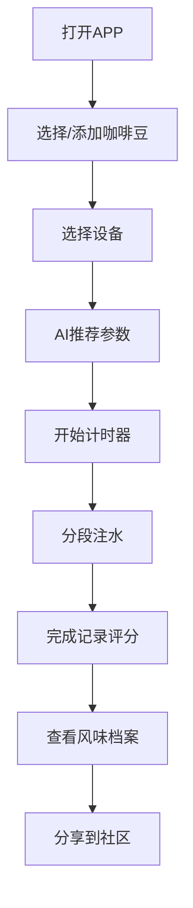

# 冲煮笔记 BrewLog - 产品需求文档

## 1. 产品概述
冲煮笔记 BrewLog 是一款面向手冲咖啡爱好者的 AI 辅助工具型 APP，将冲煮过程中的玄学转化为可记录、可复现、可分享的数据体验。用户录入咖啡豆和设备信息后，AI 智能推荐冲煮参数；冲煮过程中提供分段计时提醒；完成后记录口感评分，逐步形成个人风味档案。

- **目标用户**: 入门或进阶的手冲咖啡爱好者
- **核心价值**: 降低冲煮门槛，帮助用户稳定复现好喝的咖啡，建立个人风味数据库

## 2. 核心功能

### 2.1 用户角色
| 角色 | 注册方式 | 核心权限 |
|------|----------|----------|
| 普通用户 | 无需注册 (Demo) | 使用所有功能，本地存储数据 |

### 2.2 功能模块
1. **首页/导航**: 快速进入各功能模块，展示最近冲煮记录
2. **豆袋档案页**: 咖啡豆管理，拍照识别与手动录入
3. **设备档案页**: 器具管理，包括手冲壶、滤杯、磨豆机等
4. **AI 推荐页**: 基于豆子和设备生成冲煮参数
5. **计时器页**: 分段注水计时，实时记录数据
6. **冲煮记录页**: 记录完整冲煮过程，包括评分与照片
7. **风味档案页**: 风味雷达图，偏好趋势可视化
8. **社区流页**: 浏览分享的冲煮记录

### 2.3 页面详情

| 页面名称 | 模块名称 | 功能描述 |
|----------|----------|----------|
| 首页 | 快捷入口 | 6个核心功能模块的导航卡片 |
| 首页 | 最近记录 | 最近3条冲煮记录卡片预览 |
| 豆袋档案页 | 豆袋列表 | 已录入咖啡豆的卡片展示 |
| 豆袋档案页 | 添加豆袋 | 手动录入表单 + 拍照识别入口 |
| 设备档案页 | 设备列表 | 已录入器具的分类展示 |
| 设备档案页 | 添加设备 | 器具类型选择与信息录入 |
| AI 推荐页 | 参数推荐 | 显示水温、研磨度、粉水比等参数 |
| AI 推荐页 | 开始冲煮 | 跳转到计时器页面的按钮 |
| 计时器页 | 分段计时 | 显示各注水阶段倒计时 |
| 计时器页 | 数据记录 | 实时记录水温、注水量等 |
| 冲煮记录页 | 记录详情 | 完整冲煮参数与评分展示 |
| 冲煮记录页 | 分享卡片 | 生成分享图片 |
| 风味档案页 | 雷达图 | 可视化展示口味偏好 |
| 社区流页 | 记录流 | 展示其他用户分享的冲煮记录 |

## 3. 核心流程

### 3.1 冲煮流程
用户打开APP → 选择/添加咖啡豆 → 选择设备 → AI推荐参数 → 开始计时器 → 分段注水 → 完成记录评分 → 查看风味档案 → 分享到社区

### 3.2 流程图

## 4. 用户界面设计

### 4.1 设计风格
- **主色调**: 暖咖啡色系 (深棕 #8B4513, 浅棕 #D2691E, 奶咖色 #F5E6D3)
- **辅助色**: 深绿 #2F4F4F (强调环保自然感), 金色 #DAA520 (高级感点缀)
- **按钮风格**: 圆角卡片式, 带微妙阴影和hover效果
- **字体**: 标题使用衬线字体 (Georgia/Playfair Display), 正文使用无衬线字体 (Noto Sans SC)
- **布局风格**: 卡片式布局, 移动端优先的单列设计
- **图标**: 线性图标配合填充效果, 简洁现代

### 4.2 页面设计概览

| 页面名称 | 模块名称 | UI 元素 |
|----------|----------|---------|
| 首页 | 快捷入口 | 6个功能卡片, 悬停放大效果, 渐变背景 |
| 首页 | 最近记录 | 记录卡片, 带咖啡豆照片和评分星星 |
| 豆袋档案页 | 豆袋列表 | 网格布局卡片, 显示产地、烘焙度、风味标签 |
| AI 推荐页 | 参数卡片 | 大号数字显示参数, 配参数说明 |
| 计时器页 | 计时显示 | 圆形进度条, 分段提示文字, 开始/暂停按钮 |
| 计时器页 | 实时记录 | 温度计图标, 水量条, 震动/语音提示开关 |
| 冲煮记录页 | 评分组件 | 5星评分, 口感描述标签云 |
| 风味档案页 | 雷达图 | Canvas绘制的6维度风味雷达图 |
| 社区流页 | 记录卡片 | 用户头像, 冲煮照片, 参数摘要 |

### 4.3 响应式设计
- **桌面端**: 居中布局, 最大宽度 1200px, 多列网格展示
- **移动端**: 单列卡片布局, 侧滑抽屉菜单
- **触摸优化**: 大尺寸按钮 (最小 44x44px), 支持滑动操作

## 5. Demo 实现范围

### 5.1 必须实现
- ✅ 首页导航与最近记录展示
- ✅ 豆袋/设备档案管理 (手动录入)
- ✅ AI 参数推荐 (基于预设规则)
- ✅ 冲煮计时器 (分段计时 + 震动提醒)
- ✅ 冲煮记录与评分
- ✅ 风味雷达图可视化

### 5.2 简化实现
- ⭕ 拍照识别: 模拟识别结果
- ⭕ 社区流: 展示模拟数据
- ⭕ 分享卡片: 静态展示效果

### 5.3 暂不实现
- ❌ 用户注册登录
- ❌ 后端数据持久化
- ❌ 真实AI接口调用

## 6. 交互细节

### 6.1 计时器交互
- 点击"开始"后，第一段倒计时启动
- 每段结束震动提醒 (如设备支持)
- 可手动跳过当前阶段
- 暂停/继续功能

### 6.2 记录保存
- 自动保存到浏览器 localStorage
- 刷新页面数据不丢失
- 提供清空数据选项

### 6.3 数据可视化
- 风味雷达图使用 Canvas 绘制
- 支持鼠标悬停显示具体数值
- 记录评分使用星级组件