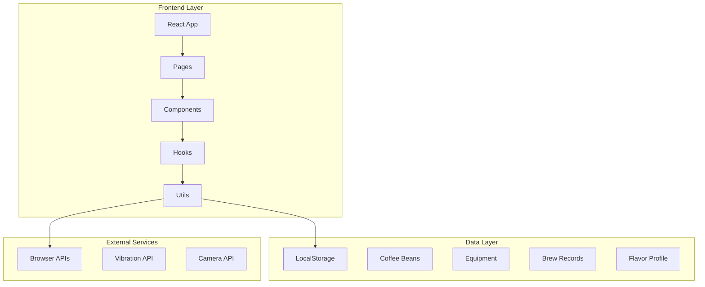
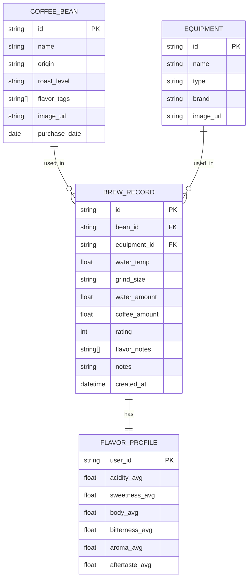

# 冲煮笔记 BrewLog - 技术架构文档

## 1. 架构设计



## 2. 技术栈描述

### 2.1 前端技术
- **框架**: React 18 + Vite
- **样式**: Tailwind CSS 3
- **路由**: React Router v6
- **状态管理**: React Context + useReducer
- **数据持久化**: Browser LocalStorage
- **图表**: Canvas 2D (风味雷达图)

### 2.2 初始化工具
- **构建工具**: Vite (vite-init)
- **包管理器**: npm

### 2.3 无后端架构
- **数据存储**: 浏览器 LocalStorage
- **AI推荐**: 前端预设规则引擎
- **计时器**: JavaScript setInterval
- **震动提醒**: Browser Vibration API

## 3. 路由定义

| 路由 | 目的 | 组件名称 |
|------|------|----------|
| `/` | 首页, 展示功能入口和最近记录 | HomePage |
| `/beans` | 豆袋档案管理 | BeansPage |
| `/equipment` | 设备档案管理 | EquipmentPage |
| `/recommend` | AI 参数推荐 | RecommendPage |
| `/timer` | 冲煮计时器 | TimerPage |
| `/records` | 冲煮记录列表 | RecordsPage |
| `/records/:id` | 单条记录详情 | RecordDetailPage |
| `/profile` | 风味档案 | ProfilePage |
| `/community` | 社区流 | CommunityPage |

## 4. 组件结构

### 4.1 页面组件 (Pages)
```
src/pages/
├── HomePage.jsx          # 首页
├── BeansPage.jsx         # 豆袋档案
├── EquipmentPage.jsx     # 设备档案
├── RecommendPage.jsx     # AI推荐
├── TimerPage.jsx         # 计时器
├── RecordsPage.jsx       # 记录列表
├── RecordDetailPage.jsx  # 记录详情
├── ProfilePage.jsx       # 风味档案
└── CommunityPage.jsx     # 社区流
```

### 4.2 通用组件 (Components)
```
src/components/
├── Layout/
│   ├── Header.jsx        # 顶部导航
│   ├── Navigation.jsx    # 底部导航栏
│   └── Layout.jsx        # 布局容器
├── common/
│   ├── Button.jsx        # 按钮组件
│   ├── Card.jsx          # 卡片组件
│   ├── StarRating.jsx    # 星级评分
│   └── Modal.jsx         # 模态框
├── beans/
│   ├── BeanCard.jsx      # 豆袋卡片
│   └── BeanForm.jsx      # 添加豆袋表单
├── equipment/
│   ├── EquipmentCard.jsx # 设备卡片
│   └── EquipmentForm.jsx # 添加设备表单
├── timer/
│   ├── TimerDisplay.jsx  # 计时显示
│   └── StageIndicator.jsx # 阶段指示器
├── record/
│   ├── RecordCard.jsx    # 记录卡片
│   └── RecordForm.jsx    # 记录表单
└── chart/
    └── FlavorRadar.jsx   # 风味雷达图
```

## 5. 数据模型

### 5.1 实体关系图


### 5.2 数据定义 (TypeScript 类型)

```typescript
// 咖啡豆
interface CoffeeBean {
  id: string;
  name: string;
  origin: string;        // 产地
  roastLevel: 'light' | 'medium' | 'dark';
  flavorTags: string[];  // 风味标签: ['果酸', '花香', '坚果']
  imageUrl?: string;
  purchaseDate: string;
  createdAt: string;
}

// 设备
interface Equipment {
  id: string;
  name: string;
  type: 'kettle' | 'grinder' | 'dripper' | 'scale' | 'other';
  brand?: string;
  imageUrl?: string;
  createdAt: string;
}

// 冲煮记录
interface BrewRecord {
  id: string;
  beanId: string;
  equipmentId: string;
  waterTemp: number;      // 水温 (℃)
  grindSize: string;      // 研磨度
  waterAmount: number;    // 注水量 (ml)
  coffeeAmount: number;   // 咖啡粉量 (g)
  totalTime: number;      // 总时长 (秒)
  rating: number;         // 评分 1-5
  flavorNotes: string[];  // 风味描述
  notes?: string;         // 笔记
  imageUrl?: string;
  createdAt: string;
}

// AI推荐参数
interface BrewRecommendation {
  waterTemp: number;
  grindSize: string;
  coffeeAmount: number;
  waterAmount: number;
  stages: BrewStage[];
}

interface BrewStage {
  name: string;           // 阶段名称: "闷蒸", "第一次注水"...
  duration: number;       // 时长 (秒)
  waterAmount: number;    // 注水量 (ml)
}
```

## 6. 核心功能实现

### 6.1 AI 推荐规则引擎
```javascript
// 基于预设规则生成推荐参数
function generateRecommendation(bean, equipment) {
  const rules = {
    light: { temp: 92, ratio: 1:16, stages: [...] },
    medium: { temp: 90, ratio: 1:15, stages: [...] },
    dark: { temp: 88, ratio: 1:14, stages: [...] }
  };
  
  const base = rules[bean.roastLevel];
  return {
    waterTemp: base.temp,
    grindSize: '中细',
    coffeeAmount: 15,
    waterAmount: base.ratio * 15,
    stages: base.stages
  };
}
```

### 6.2 计时器实现
```javascript
// 使用 setInterval 实现计时器
class BrewTimer {
  constructor(stages) {
    this.stages = stages;
    this.currentStage = 0;
    this.remaining = stages[0].duration;
    this.timerId = null;
  }
  
  start() {
    this.timerId = setInterval(() => {
      this.remaining--;
      if (this.remaining <= 0) {
        this.nextStage();
      }
    }, 1000);
  }
  
  nextStage() {
    navigator.vibrate(200); // 震动提醒
    this.currentStage++;
    if (this.currentStage < this.stages.length) {
      this.remaining = this.stages[this.currentStage].duration;
    }
  }
}
```

### 6.3 风味雷达图
```javascript
// Canvas 绘制6维雷达图
function drawFlavorRadar(canvas, data) {
  const ctx = canvas.getContext('2d');
  const centerX = canvas.width / 2;
  const centerY = canvas.height / 2;
  const radius = Math.min(centerX, centerY) * 0.7;
  
  const dimensions = ['酸度', '甜度', '醇度', '苦度', '香气', '余韵'];
  const angleStep = (2 * Math.PI) / 6;
  
  // 绘制网格线
  // 绘制数据区域
  // 绘制标签
}
```

## 7. 状态管理

### 7.1 全局状态结构
```javascript
const GlobalState = {
  beans: [],           // 咖啡豆列表
  equipment: [],       // 设备列表
  records: [],         // 冲煮记录
  currentTimer: null,  // 当前计时器状态
  recommendation: null // AI推荐参数
};
```

### 7.2 LocalStorage 键名
- `brewlog_beans`
- `brewlog_equipment`
- `brewlog_records`

## 8. 性能优化

### 8.1 代码分割
- 使用 React.lazy 动态导入页面组件
- 路由级别代码分割

### 8.2 数据缓存
- LocalStorage 持久化
- 读取时使用 useMemo 缓存

### 8.3 动画优化
- CSS transform 代替 top/left
- will-change 提示浏览器优化

## 9. 浏览器兼容性

### 9.1 目标浏览器
- Chrome 90+
- Safari 14+
- Firefox 88+
- Edge 90+

### 9.2 API 兼容性处理
- Vibration API: 降级为视觉提示
- Camera API: 提示不支持时手动输入

## 10. 项目结构

```
brewlog/
├── public/
│   └── index.html
├── src/
│   ├── components/      # 可复用组件
│   ├── pages/           # 页面组件
│   ├── hooks/           # 自定义 Hooks
│   ├── utils/           # 工具函数
│   ├── context/         # React Context
│   ├── data/            # 模拟数据
│   ├── App.jsx
│   └── main.jsx
├── .gitignore
├── package.json
├── tailwind.config.js
└── vite.config.js
```